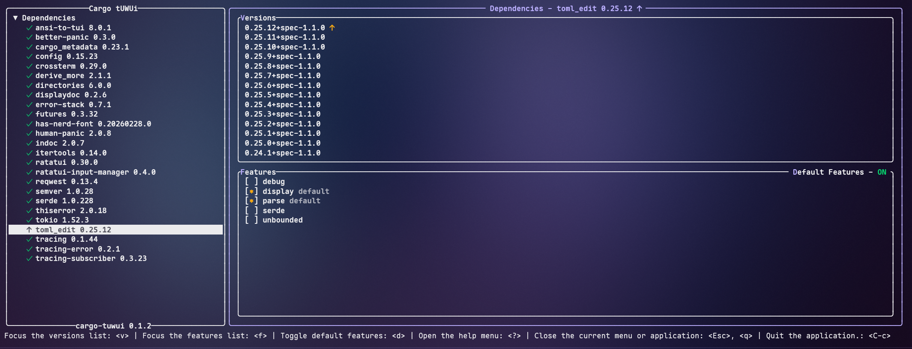
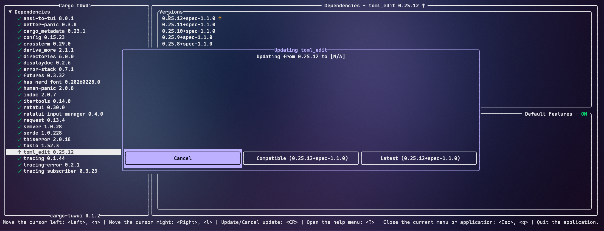
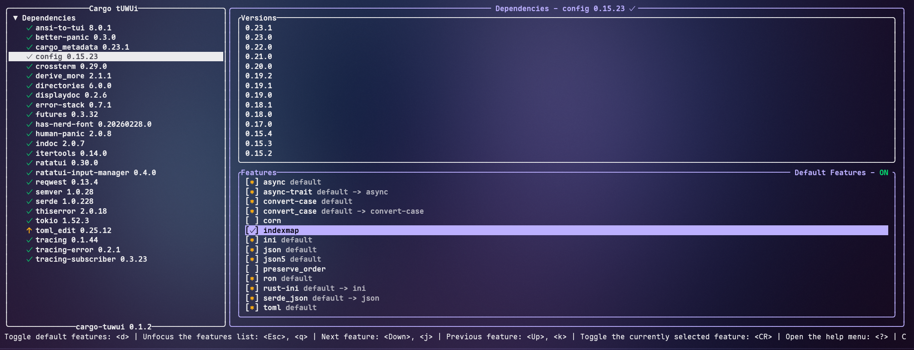

# cargo-tuwui

A [Ratatui] TUI to manage your Cargo.toml

[Ratatui]: https://ratatui.rs

## Images




## Installation

### Latest version
```sh
cargo install cargo-tuwui
```

### From git
```sh
cargo install --git https://github.com/Suya1671/cargo-tuwui
```

## Usage

In your project where the Cargo.toml file is:

```sh
cargo tuwui
```

## Limitations
- Only works with the official [crates.io] registry for now
  - It _will_ crash if you have any git or path dependencies. Sorry! WIP moment
- Only works with regular full semantic versioning (i.e. `1.2.3`)
  - Attached build metadata is ignored
  - Versions that are only partially specified (e.g. `1.2`) work, but will always show as having an update.
  - Updating will specify the full version (e.g. `1.2.1`)
- This can't handle if your Cargo.toml externally updates while it's is running. If you do that, it will just overwrite your changes when you save it in the TUI.

## AI Usage
No Agents were used to write code. AI Autocompletion (GitHub Copilot, Zed Zeta) were used. AI was used during some code review/figuring out how to do certain things (such as certain layouting in ratatui).

The code sucks not because it was vibe coded but because I suck at organising where things belong :ferrisClueless: Although I do want to make this better through using a component-like model.

[crates.io]: https://crates.io

## License

Copyright (c) Suya Singh <suya1671@tuta.io>

This project is licensed under the MIT license ([LICENSE] or <http://opensource.org/licenses/MIT>)

[LICENSE]: ./LICENSE
